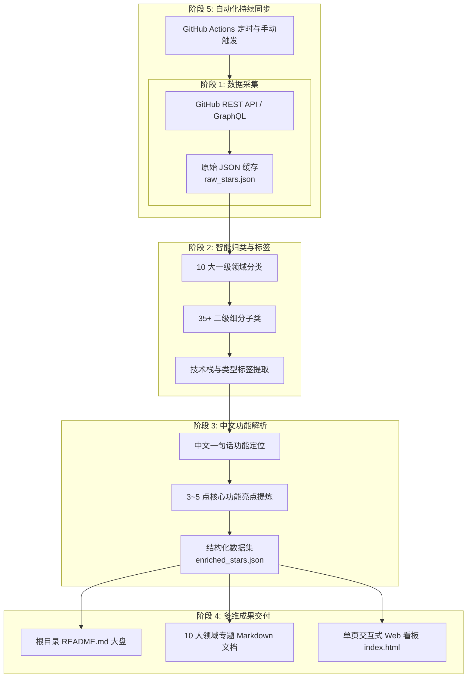

# 01 - 主方案：GitHub Stars 知识库总体架构与规划

## 1. 项目背景与目标

本方案旨在对 GitHub 用户 [`ztj1993`](https://github.com/ztj1993?tab=stars) 收藏的全部 **710+** 个 Star 开源仓库进行全量抓取、深度多维分类、技术标签标注以及高质量中文功能解析，最终构建一套兼具文档化查阅与实时交互检索能力的个人开源资产知识库。



---

## 2. 核心技术选型

| 模块 | 选型技术 | 选型原因 |
| :--- | :--- | :--- |
| **数据采集与处理** | Python 3.12 (urllib / json / re / collections) | 原生标准库零额外依赖，跨平台兼容性极强，解析性能高 |
| **文档生成** | Python 模板渲染引擎 | 高性能批量生成标准 GitHub Flavored Markdown |
| **交互式 Web 看板** | HTML5 + Tailwind CSS + Alpine.js + FontAwesome | 纯静态单文件即开即用，无需后端与构建步骤，支持离线与即时秒搜 |
| **自动化 CI/CD** | GitHub Actions (`.github/workflows/update-stars.yml`) | 云端自动化运行，定时增量抓取最新 Star 并自动提交回仓库 |

---

## 3. 总体分阶段推进计划

- **[02 - 分步骤方案：数据采集与安全缓存](./02-分步骤方案-数据采集与安全缓存.md)**：安全分页抓取全量 Star 元数据，规避 API 速率限制。
- **[03 - 分步骤方案：一级与二级分类体系设计](./03-分步骤方案-一级与二级分类体系设计.md)**：构建 10 大核心领域与 35+ 二级子分类的完整映射模型。
- **[04 - 分步骤方案：中文内容解析与功能深度提炼](./04-分步骤方案-中文内容解析与功能深度提炼.md)**：精准提炼中文定位概括与 3~5 点核心功能亮点。
- **[05 - 分步骤方案：多维文档与交互式 Web 看板](./05-分步骤方案-多维文档与交互式Web看板.md)**：输出结构化 Markdown 文档与支持级联过滤的交互式 Web 页面。
- **[06 - 分步骤方案：GitHub Actions 持续集成与自动同步](./06-分步骤方案-GitHub-Actions持续集成与自动同步.md)**：自动化运维流设计，保持知识库长期最新。
- **[07 - 升级方案：二级分类体系重构与级联看板](./07-升级方案-二级分类体系重构与级联看板.md)**：二级分类专项深度重构与前端交互优化细节。

---

## 4. 目录规范与交付清单

```
my-stars/
├── .github/workflows/
│   └── update-stars.yml             # GitHub Actions 自动化更新工作流
├── data/
│   ├── raw_stars.json               # 原始采集数据
│   └── enriched_stars.json          # 结构化归类与中文介绍数据
├── docs/
│   └── categories/                  # 10 大技术领域专题文档
│       ├── ai-llm.md                # 🤖 AI 与大模型
│       ├── backend.md               # ⚙️ 后端架构与微服务
│       ├── cli-tools.md             # 🛠️ 效率工具与 CLI
│       ├── data-scraping.md         # 🕷️ 数据处理与爬虫
│       ├── database.md              # 🗄️ 数据库与存储
│       ├── devops.md                # ☁️ DevOps 与云原生
│       ├── frontend.md              # 🎨 前端与跨端开发
│       ├── learning-resources.md    # 📚 资源精选与学习指南
│       ├── media.md                 # 🎬 影音多媒体与图形
│       └── security.md              # 🛡️ 网络安全与逆向
├── plans/                           # 方案与规划文档全集 (从 01 开始编号)
├── scripts/
│   ├── fetch_stars.py               # Stars 数据抓取脚本
│   ├── enrich_stars.py              # 中文解析与智能归类引擎
│   └── generate_docs.py             # Markdown 文档与 Web UI 生成器
├── index.html                       # 独立交互式检索 Web 看板
└── README.md                        # 项目总览导航与统计大盘
```
