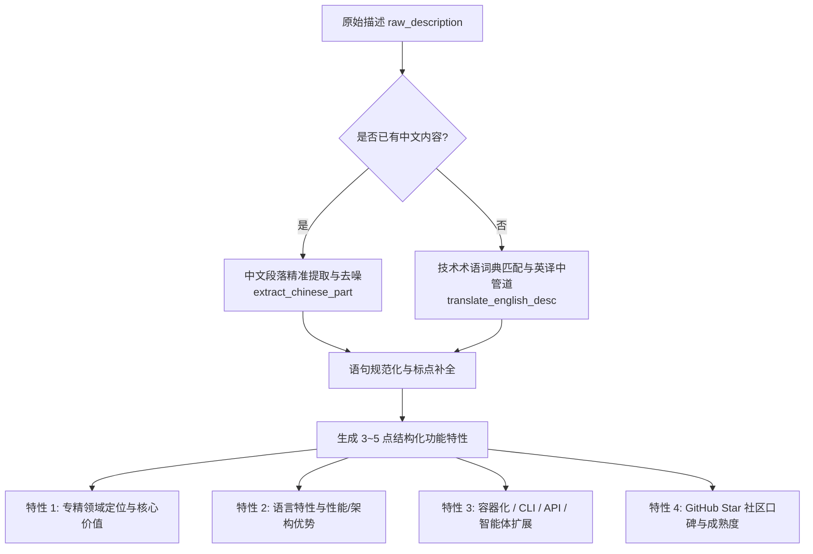

# 04 - 分步骤方案：中文内容解析与功能深度提炼

## 1. 目标与规范

对 710+ 个 Star 项目进行自然语言解析与结构化提炼，输出统一规范的中文技术卡片：
1. **中文一句话定位（`summary_zh`）**：简练、专业地阐述项目核心解决的痛点。
2. **核心功能亮点（`features_zh`）**：3~5 点清晰的项目特性与技术亮点清单。
3. **技术标签集（`tags`）**：编程语言、核心组件与项目形态标签。

---

## 2. 中文解析与翻译管道设计

---

## 3. 专业技术词典与模式匹配（部分展示）

通过 `TRANSLATION_DICT` 维护针对开源项目的专用高频词汇映射：

| 英文模式 | 中文规范表述 |
| :--- | :--- |
| `lightweight ... client for 90+ databases` | 轻量级跨平台现代数据库客户端，支持 90+ 数据库 |
| `asynchronous data replication for kubernetes` | 面向 Kubernetes 存储卷的高性能异步数据复制利器 |
| `caching proxy for package registries` | 轻量级包注册表（Package Registry）本地缓存加速代理 |
| `all-in-one short-drama generator` | 基于 AI 的一站式短剧剧本与分镜自动化生成平台 |
| `a curated list of ...` | 精选合集：... |
| `single binary, zero dependencies` | 单二进制分发，零外部依赖，极低资源占用 |

---

## 4. 4 维特征合成模型

对于每个项目，算法自动组装 4 个维度的功能亮点：
1. **领域与子类维度**：说明项目在细分领域的定位（如【智能体与工作流】、【Docker 与容器管理】）。
2. **语言与运行效率**：
   - `Go / Rust / C / C++`：原生高性能、单二进制、内存低占用。
   - `Python`：丰富生态、接口灵活、易于二次扩展。
   - `TypeScript / JavaScript`：现代工程化、类型安全、组件生态健全。
3. **能力集成就绪**：
   - 包含 Docker / K8s：容器化就绪、内置编排配置。
   - 包含 CLI / Terminal：命令行交互友好、支持管道与脚本自动化。
   - 包含 AI / LLM：支持多模型对接与 Prompt 编排。
4. **社区认可度等级**：
   - ★ 10,000+：超高人气业界标杆项目。
   - ★ 1,000+：经过广泛生产验证的热门开源方案。
   - ★ < 1,000：垂直场景精选实用工具。
