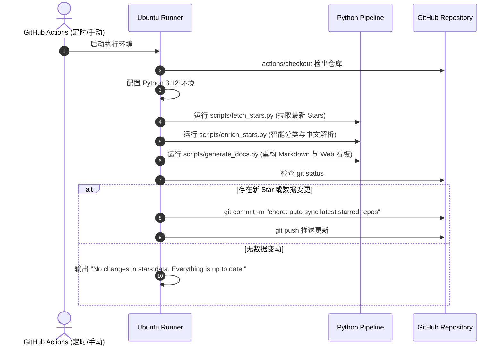

# 06 - 分步骤方案：GitHub Actions 持续集成与自动同步

## 1. 目标与机制

保证知识库具有“自我维护与持续更新”的能力。当用户在日常使用 GitHub 收藏了新的项目时，系统能自动将增量数据同步至本知识库中，并重新生成文档和 Web 看板。

---

## 2. 工作流设计（`.github/workflows/update-stars.yml`）

### 2.1 触发条件
1. **定时触发（Cron）**：
   - 每周日 UTC 00:00（北京时间 08:00）自动执行全量检查与增量同步。
2. **手动一键触发（Workflow Dispatch）**：
   - 支持在 GitHub 网页端的 Actions 页面点击 `Run workflow` 立即同步。

### 2.2 工作流执行步骤



---

## 3. 工作流 YAML 配置

```yaml
name: Sync & Update GitHub Stars

on:
  schedule:
    - cron: '0 0 * * *'
  workflow_dispatch:

permissions:
  contents: write

jobs:
  sync-stars:
    runs-on: ubuntu-latest

    steps:
      - name: Checkout Repository
        uses: actions/checkout@v4

      - name: Set up Python 3.12
        uses: actions/setup-python@v5
        with:
          python-version: '3.12'

      - name: Fetch Latest Stars from GitHub
        env:
          GITHUB_TOKEN: ${{ secrets.GITHUB_TOKEN }}
        run: |
          python scripts/fetch_stars.py

      - name: Enrich & Classify Stars
        run: |
          python scripts/enrich_stars.py

      - name: Generate Markdown Docs & Web Dashboard
        run: |
          python scripts/generate_docs.py

      - name: Commit & Push Changes
        run: |
          git config --global user.name "github-actions[bot]"
          git config --global user.email "github-actions[bot]@users.noreply.github.com"
          git add data/ docs/ README.md index.html
          if git diff --staged --quiet; then
            echo "No changes in stars data. Everything is up to date."
          else
            git commit -m "chore(stars): auto sync latest starred repositories [skip ci]"
            git push
          fi
```
