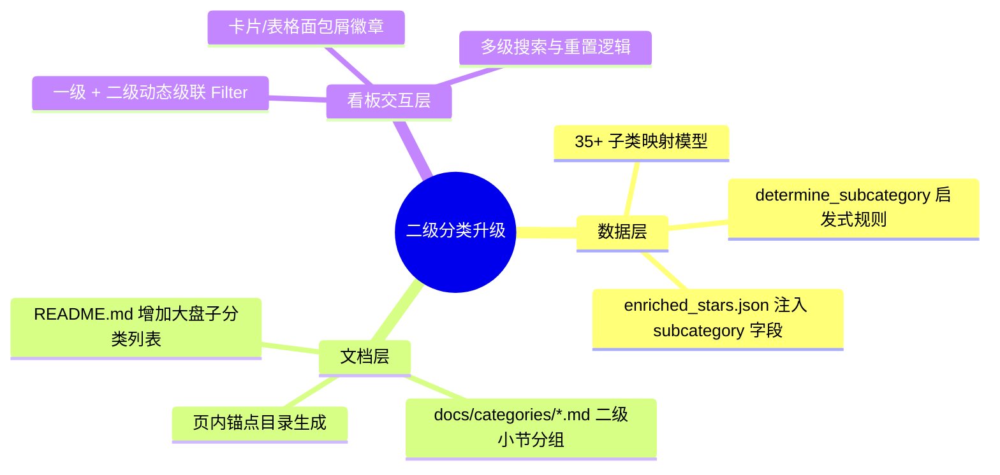

# 07 - 升级方案：二级分类体系重构与级联看板

## 1. 升级背景与痛点

在初期仅有一级分类（10 大领域）时，部分热门领域（如 **DevOps 与云原生 (155 个)**、**前端与跨端开发 (132 个)**、**效率工具与 CLI (113 个)**）聚集了过百个项目，缺乏更垂直的场景化定位，查找特定工具（例如仅查找“代理穿透”或“AI 短剧生成”）仍需翻找较多条目。

因此，实施**二级分类（Subcategories）体系专项升级**。

---

## 2. 核心升级内容

---

## 3. 核心改进清单

### 3.1 数据层升级（`scripts/enrich_stars.py`）
- 增加 `SUBCATEGORIES` 字典，覆盖每个一级领域的 2~5 个二级细分子类。
- 新增 `determine_subcategory(repo, category)` 算法，结合仓库 Topics、描述、语言与专有关键字，实现 710 个项目 **100% 精确覆盖**。

### 3.2 专题文档结构升级（`scripts/generate_docs.py`）
- 在 10 个领域专题文档中，由原本的单一列表升级为：
  1. 顶部二级子类目录导航（带项目数徽章与锚点跳转链接）。
  2. 按照各二级子类的项目 Star 数降序排列输出。
  3. 卡片中增加 `二级分类: [图标] [子类名]` 专属标签。

### 3.3 交互式 Web 看板升级（`index.html`）
- **动态级联筛选栏**：选择任意一级领域后，下方即时展开属于该领域的二级子分类胶囊按钮（带实时计数）。
- **面包屑设计**：每个项目卡片顶部显示 `[一级领域] › [二级子类]` 徽章，点击直观明确。
- **全字段模糊检索**：搜索框支持直接搜索二级子分类名称（如搜索“智能体”或“软路由”），秒级筛选出相关项目。

---

## 4. 升级后各二级分类统计

- 🤖 **AI 与大模型 (68)**：智能体与工作流 (31) ｜ 大模型应用与客户端 (20) ｜ 模型微调与底层工具 (8) ｜ AI 生成与短剧/多模态 (6) ｜ 语音识别与音频处理 (3)
- 🎨 **前端与跨端开发 (132)**：Vue 生态与组件库 (58) ｜ 跨端与桌面应用 (26) ｜ 前端工程化与样式工具 (26) ｜ React 与全栈框架 (15) ｜ 浏览器扩展与插件 (7)
- ⚙️ **后端架构与微服务 (102)**：Go 后端与微服务 (37) ｜ PHP 与快速开发 (23) ｜ Python 后端与 API (19) ｜ Node.js / Java 框架 (18) ｜ API 网关与通信协议 (5)
- ☁️ **DevOps 与云原生 (155)**：Docker 与容器管理 (80) ｜ 网络代理与内网穿透 (23) ｜ 软路由与网络系统 (20) ｜ CI/CD 与运维监控 (19) ｜ Kubernetes 与编排 (13)
- 🛠️ **效率工具与 CLI (113)**：账号管理与开发提效 (43) ｜ 终端工具与 TUI (38) ｜ 系统增强与桌面工具 (16) ｜ 开发规范与代码管理 (10) ｜ 下载器与传输工具 (6)
- 🗄️ **数据库与存储 (76)**：关系型与 NoSQL 数据库 (44) ｜ 数据库客户端与管理工具 (10) ｜ ORM 与数据访问层 (10) ｜ 对象存储与备份同步 (7) ｜ 向量数据库与搜索引擎 (5)
- 🕷️ **数据处理与爬虫 (16)**：网页爬虫与自动化 (8) ｜ 数据解析与表格处理 (7) ｜ 数据可视化与报表 (1)
- 📚 **资源精选与学习指南 (25)**：Awesome 精选合集 (19) ｜ 学习路线与实战指南 (6)
- 🛡️ **网络安全与逆向 (12)**：网络安全攻防与审计 (8) ｜ 漏洞扫描与渗透测试 (2) ｜ 逆向工程与调试 (2)
- 🎬 **影音多媒体与图形 (11)**：流媒体与播放器 (5) ｜ 音视频处理与转码 (4) ｜ 图形渲染与 3D (2)
